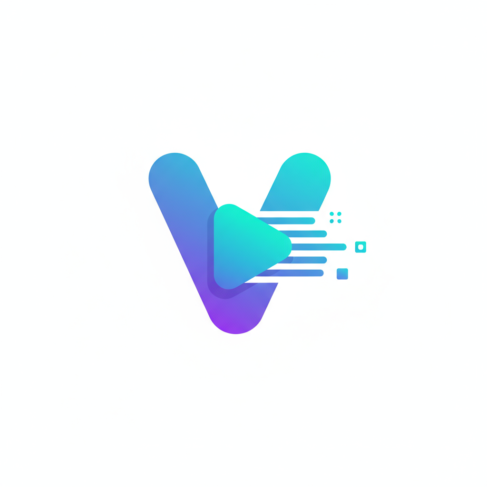
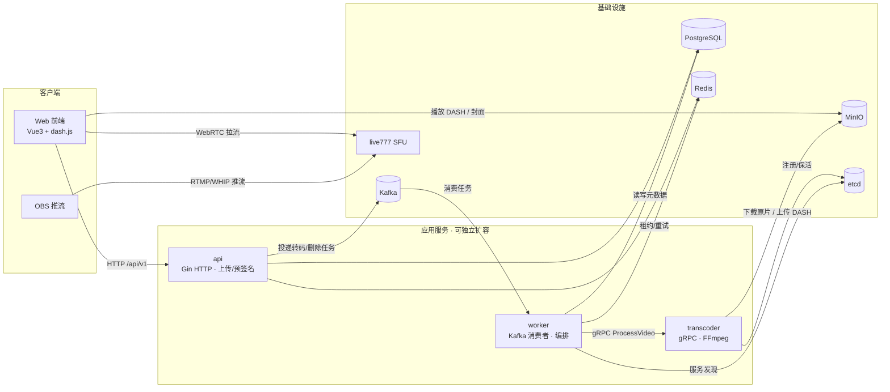

<h1 align="center">
  
  <br/>
  Vistack
</h1>

<p align="center">
  <b>高性能 · 分布式 · 云原生的直播与点播一体化视频平台</b>
</p>

<p align="center">
  <a href="https://vistack.pages.dev"></a>
  
  
  
  
  
  
  
  
</p>

---

## ✨ 简介

**Vistack** 是一个面向高并发场景的分布式视频平台，同时支持**实时直播（Live Streaming）**与**视频点播（VOD）**。项目以「高并发、可水平扩展」为核心设计目标，实践了一套云原生的分布式转码与流媒体架构：任务队列解耦、gRPC 远程转码、etcd 服务发现、对象存储分发，全部可一键容器化并平滑迁移至 Kubernetes。此外还内置了一套高并发应用层能力——Redis 缓存三件套、分布式限流、点赞/收藏/播放量计数与热门榜单，覆盖面试高频的「高并发场景题」。

> 🎯 在线体验：<https://vistack.pages.dev>

## 🚀 核心特性

### 视频点播（VOD）
- **分片上传 + 秒传**：MinIO Multipart 直传 + 文件哈希去重，断点续传。
- **自适应码率（DASH ABR）**：FFmpeg 按源分辨率智能选择 240p–4K 档位，`manifest.mpd` + `init-*.m4s` / `chunk-*.m4s` 分片，前端 dash.js 无缝切换清晰度。
- **远程转码服务**：FFmpeg 隔离在独立容器，通过 **gRPC `ProcessVideo`** 调用，输入/输出均走 MinIO，无状态、可任意副本接任务。
- **防盗链**：预签名 URL / STS 临时凭证鉴权。

### 直播（Live）
- 基于 **live777（Rust SFU）** 的 WebRTC 分发，服务端轻量、高并发，OBS 推流 → 多端拉流。

### 分布式与可扩展
- **三角色拆分**：`api` / `worker` / `transcoder` 三个进程独立部署、独立扩容。
- **任务队列**：Kafka 分发转码/删除任务，Redis ZSet 指数退避重试 + Watchdog 超时兜底。
- **服务发现**：transcoder 实例向 **etcd** 注册并保活，worker 经 etcd 动态发现 + gRPC `round_robin` 负载均衡。
- **容器化 & 云原生**：Docker Compose 一键起栈，附 Kubernetes 清单。

### 安全与权限
- JWT 认证、RBAC 细粒度权限（`authorities` + 角色/用户两级授权）、推流密钥校验。

### 高并发能力
- **Redis 缓存层**：Cache-Aside 通用组件，穿透（空值缓存 + 布隆过滤器）、击穿（singleflight + Redis 互斥锁）、雪崩（随机 TTL）三件套，接入视频详情与推荐列表。
- **分布式限流**：登录后接口按用户 ID 限流，令牌桶（单机）+ Redis Lua 滑动窗口（分布式）两种算法可配置切换，429 + `Retry-After` + `X-RateLimit-*`，Redis 不可用 fail-open。
- **点赞/收藏/播放量**：Redis Set 去重计数 + 播放 `INCR`，Lua 原子 toggle、事件队列异步批量落库（幂等），`videos` 冗余计数列 + 明细表，ZSet 热门榜单。

## 🧩 系统架构



### 转码流水线

```
上传分片 ──> api(CompleteVideoUpload) ──> Kafka[transcode]
  ──> worker 消费 ──> 置 processing ──> etcd 发现 transcoder
  ──> gRPC ProcessVideo ──> transcoder: MinIO 下载 → ffprobe → 抽封面 → DASH 转码 → MinIO 上传
  ──> 返回(时长/清单/封面/档位) ──> worker 事务写库 ──> 视频 published
```

失败时按指数退避重投；处理中超时由 Watchdog 兜底；删除视频走 `Kafka[delete_file]` 异步清理对象与元数据。

## ⚙️ 技术栈

| 层级 | 技术 |
|------|------|
| 前端 | Vue 3 + Pinia + Tailwind CSS + dash.js / Video.js |
| 后端 API | Go 1.26 + Gin + GORM + PostgreSQL + Redis |
| 缓存 | Redis Cache-Aside（穿透/击穿/雪崩 + 布隆过滤器） |
| 限流 | 令牌桶（单机）+ Redis Lua 滑动窗口（分布式） |
| 社交互动 | Redis Set/INCR 计数 + 异步批量落库 + ZSet 榜单 |
| 服务通信 | gRPC + Protobuf（buf 生成） |
| 服务发现 | etcd |
| 任务队列 | Kafka（segmentio/kafka-go）+ Redis 延迟队列 |
| 转码 | FFmpeg / FFprobe（独立 transcoder 容器） |
| 对象存储 | MinIO（S3 兼容） |
| 直播 | live777（Rust SFU） |
| 部署 | Docker Compose / Kubernetes |
| 可观测性 | zap 结构化日志（预留 Prometheus/Grafana） |

## 📁 目录结构

```
Vistack
├── cmd/vistack/            # 入口：按 VISTACK_ROLE 分发 api/worker/transcoder
├── internal/
│   ├── role/               # 三角色启动引导
│   ├── api/v1/             # HTTP 处理器
│   ├── routers/            # 路由与中间件注册
│   ├── core/               # DB/Redis/MinIO/Kafka/Snowflake 等基础设施封装
│   │   ├── cache/          # 通用缓存组件（穿透/击穿/雪崩 + 布隆过滤器）
│   │   └── message_queue/  # transcode(worker/retry/watchdog)、video(删除)
│   ├── middlewares/        # auth/cors/requestid/ratelimit
│   │   └── ratelimit/      # 令牌桶（单机）+ Redis 滑动窗口（分布式）
│   ├── interaction/        # 点赞/收藏/播放量计数 + 榜单 + 异步落库
│   ├── transcoder/         # gRPC 转码服务 + ffmpeg 逻辑 + etcd 注册
│   ├── discovery/          # etcd → gRPC resolver 服务发现
│   ├── config/             # 配置结构（Viper）
│   └── model/entity/       # GORM 实体
├── proto/transcoder/v1/    # gRPC 契约（buf）
├── migrations/             # GORM 自动迁移
├── conf/                   # app.toml / app.docker.toml 配置
├── deploy/k8s/             # Kubernetes 清单
├── web/                    # pnpm monorepo：ui / web-client / web-admin
├── Dockerfile              # 双 target：vistack / vistack-transcoder
└── compose.yml             # 一键起栈
```

## 🚀 快速开始

### 方式一：Docker Compose（推荐）

```bash
cp .env.example .env.local
docker compose up --build -d
```

启动后包含 **api(8080) / worker / transcoder / etcd / PostgreSQL / Redis / MinIO / Kafka** 全套服务。水平扩容转码：

```bash
docker compose up --scale transcoder=3 -d
```

### 方式二：本地开发

**后端**（需要本地 PostgreSQL / Redis / MinIO / Kafka / etcd，或复用 compose 中的基础设施）：

```bash
go run ./cmd/vistack api        # API 服务（默认 :8080）
go run ./cmd/vistack worker     # 转码编排 Worker
go run ./cmd/vistack transcoder # gRPC 转码服务（需本机安装 FFmpeg）
```

**前端**（pnpm workspace）：

```bash
pnpm install
pnpm run dev      # 启动 web-client(:8335) 与 web-admin(:8334)
```

> 前端通过 `web/*/.env.development` 中的 `VITE_API_BASE` 指向 API，默认 `http://localhost:8333/api/v1`；请确保其与后端实际监听端口一致。

## 🔧 配置

后端配置由 Viper 加载（`conf/app.toml`，本地覆盖 `conf/app.local.toml`，容器内 `conf/app.docker.toml`），并支持 `VISTACK_` 前缀环境变量覆盖（如 `VISTACK_DATABASE_HOST`）。

| 配置段 | 说明 |
|--------|------|
| `[server]` | HTTP 监听地址/端口 |
| `[database]` / `[redis]` | PostgreSQL / Redis 连接 |
| `[minio]` | 对象存储端点、凭证、桶 |
| `[kafka]` | 消息队列 brokers 与消费组 |
| `[etcd]` | 服务发现端点与注册前缀 |
| `[transcoder]` | gRPC 监听地址、静态兜底地址、是否走 etcd 发现 |
| `[auth]` / `[cors]` | JWT 与跨域 |
| `[cache]` | Redis 缓存层（TTL 范围 / 空值 TTL / 锁 TTL / 布隆参数） |
| `[ratelimit]` | 登录接口限流（算法 / 阈值 / 窗口） |
| `[social]` | 点赞/收藏/播放量（落库间隔 / 批量 / 榜单容量） |

三个角色通过 `VISTACK_ROLE`（或启动命令首个位置参数）选择：`api` / `worker` / `transcoder`。

## 🗄️ 数据库表结构

| 模块 | 表名 | 说明 |
|------|------|------|
| 用户 & 权限 | `users` | 用户基本信息（登录凭证、邮箱、状态、角色） |
| | `user_profiles` | 用户扩展资料（昵称、头像） |
| | `roles` / `authorities` | 角色表 / 权限表（资源方法 + URI） |
| | `role_authority` / `user_authority` | 角色-权限 / 用户-权限关联（RBAC） |
| 文件管理 | `files` | 通用文件表（桶、Key、引用类型、大小、引用计数） |
| 视频管理 | `videos` | 视频主表（标题、描述、封面、时长、状态、可见性、点赞/收藏/播放计数） |
| | `video_sources` | 原始视频上传记录 |
| | `video_transcodes` | 转码任务与状态（进度、分辨率、编码、清单文件） |
| | `video_manifest` | 播放清单（DASH/HLS、协议、码率档位） |
| 标签系统 | `tags` / `video_tags` | 标签及视频-标签多对多 |
| 社交互动 | `video_comments` | 评论（父子结构） |
| | `video_likes` / `video_favorites` | 点赞 / 收藏（复合主键；Redis Set 去重计数，异步落库） |
| 播放统计 | `video_play_logs` | 播放日志（用户、时间、IP、UA；播放量 Redis `INCR`，异步落库） |

## 🗺️ Roadmap

- [ ] 压测与性能对比报告（k6/wrk：缓存/限流/点赞 优化前后 QPS/P99）
- [ ] 点赞/播放计数 Redis 持久化与重启重建（防止计数丢失）
- [ ] 播放上报 IP 限流（防匿名刷量）
- [ ] 布隆过滤器定期重建（防 `Add` 失败导致的假阴性）
- [ ] 转码进度实时上报（server-streaming）
- [ ] gRPC mTLS 鉴权
- [ ] etcd 集群高可用
- [ ] Prometheus / Grafana 可观测性接入
- [ ] HLS 兼容输出

## 🤝 贡献

欢迎提交 Issue 与 Pull Request。贡献前请先阅读代码规范并遵循既有目录分层（`api` / `worker` / `transcoder` 职责边界见架构图）。

## 📄 License

本项目基于 [MIT License](./LICENSE) 发布，© 2025 Bin-hy。
